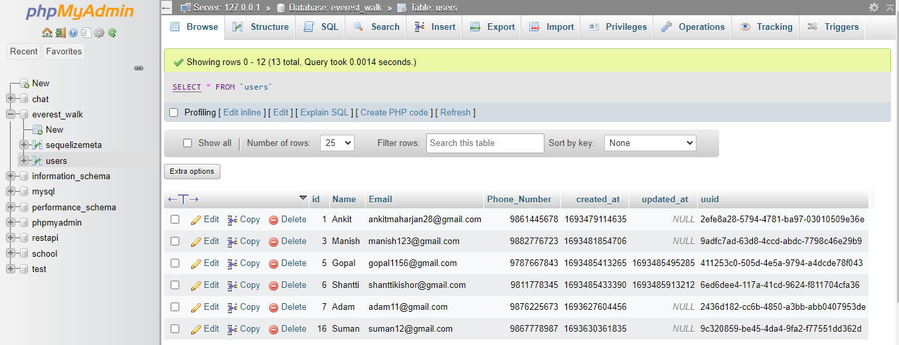

# everest_walk

# RESTful API in Node.js

This project implements a RESTful API using Node.js and Express.js in Monolith Event Driven Architecture, with data storage in a relational database (MySQL). The API allows users to manage records, including creation, retrieval, updating, and deletion, while ensuring data integrity and error handling through debugging.




## Technologies Used

Programming Language
- JavaScript
➢ Database: PhpMyAdmin
➢ Server Implementation: XAMPP Apache
➢ Editor: Visual Studio Code
➢ API Testing: Postman


## Table of Contents

- [Requirements](#requirements)
- [Getting Started](#getting-started)
  - [Installation](#installation)
  - [Database Configuration](#database-configuration)
- [API Endpoints](#api-endpoints)
- [Data Validation](#data-validation)
- [Error Handling](#error-handling)
- [Testing](#testing)
- [Database Setup](#database-setup)
- [Additional Features](#additional-features)
- [Contributing](#contributing)
- [License](#license)

## Requirements

1. Node.js and npm installed.
2. A relational database system (MySQL).
3. Basic knowledge of JavaScript and Express.js.
4. Optionally, a testing framework (Jest, Mocha, etc.).

## Getting Started

### Installation

1. Clone this repository:

   ```bash
   https://github.com/ankitmaharjan/everest_walk

   Install dependencies:
   npm install <packagename> 

   Database Configuration
Create a database in your chosen database system (MySQL).

Copy the .env.example file to .env and configure the database connection details in .env.

DB_HOST=localhost
DB_PORT=3306
DB_USER=root
DB_PASSWORD=password
DB_DATABASE=mydatabase

## API Endpoints
POST /api/records: Create a new record. Include name, email, and phoneNumber in the request body.

GET /api/records: Retrieve a list of all records.

GET /api/records/:id: Retrieve a single record by its unique identifier.

PUT /api/records/:id: Update an existing record by its unique identifier. Include updated data in the request body.

DELETE /api/records/:id: Delete a record by its unique identifier.

## FEATURES
## Data Validation
Data validation is implemented to ensure the correctness of incoming data. Invalid requests will receive an appropriate error response with a 400 status code.

## Error Handling
Proper error handling is implemented to provide informative error messages with corresponding HTTP status codes. Error messages are designed to be helpful for debugging and for informing API consumers about the issue.

## Testing
To run tests (using Mocha or Jest as an example): I have configure the path in package.json 
We can simple run: npm test

## Database Setup
This project uses Sequelize as the ORM (Object-Relational Mapping) library. You need to run database migrations to create the necessary tables:
npm run migrate

## Additional Features
This README covers the basic requirements. You can further enhance this API by adding features like authentication, pagination, filtering, or sorting for the list of records. Additionally, you can implement validation middleware, request logging, and API documentation using tools like Swagger.

Contributing
Feel free to contribute to this project by opening issues or pull requests. Your contributions are highly appreciated.

License
This project is licensed under the MIT License - see the LICENSE file for details.


Please replace `<https://github.com/ankitmaharjan/everest_walk>` in the installation instructions with the actual URL of your Git repository.

This README template provides a structure for your project's documentation. You can customize it to fit your project's specific details and requirements. Additionally, you can include more details about your database setup and the specific code organization used in your project.


## Simple Quick Instruction to set it up and run the server.
In this section of your `README.md`, you provide step-by-step instructions for users to:

1. Clone the repository.
2. Install project dependencies.
3. Configure the database connection by copying and modifying the `.env` file.
4. Run the server using `npm start`.

Be sure to replace `<repository-url>` and `your-project-directory` with the actual URL of your Git repository and your project's directory name. Adjust the instructions to match your project's specific setup if necessary.

Including clear and concise instructions in your README.md helps users and contributors get your project up and running quickly.

## Summary/Documentation
   ## Architectural Decisions
   Project Structure: The project follows a modular structure with separate folders for routes, controllers, models, configuration, migrations, and tests as a Monolith Event Driven Architecture. This organization enhances code maintainability and readability.

   Express.js: Express.js is used as the web framework to handle HTTP requests and responses efficiently.

   Sequelize: Sequelize is chosen as the Object-Relational Mapping (ORM) library for database interactions. It provides an abstraction layer for database operations, making it easy to work with relational databases like MySQL.

   Middleware: Middleware functions are employed for request validation, error handling, and setting up routes.

   Testing: Mocha and Chai are used for unit testing. The npm test script runs tests located in the tests  directory.

   ## Challenges Faced
   Data Validation: Implementing proper data validation to ensure the integrity of user data was a challenge. I addressed this by using validation libraries and custom middleware.

   Database Configuration: Configuring the database connection and setting up migrations required careful consideration of environment variables and database-specific settings.

   Testing: Writing comprehensive unit tests for all API endpoints was time-consuming but essential for ensuring the reliability of the application while using Mocha, chai for testing.

